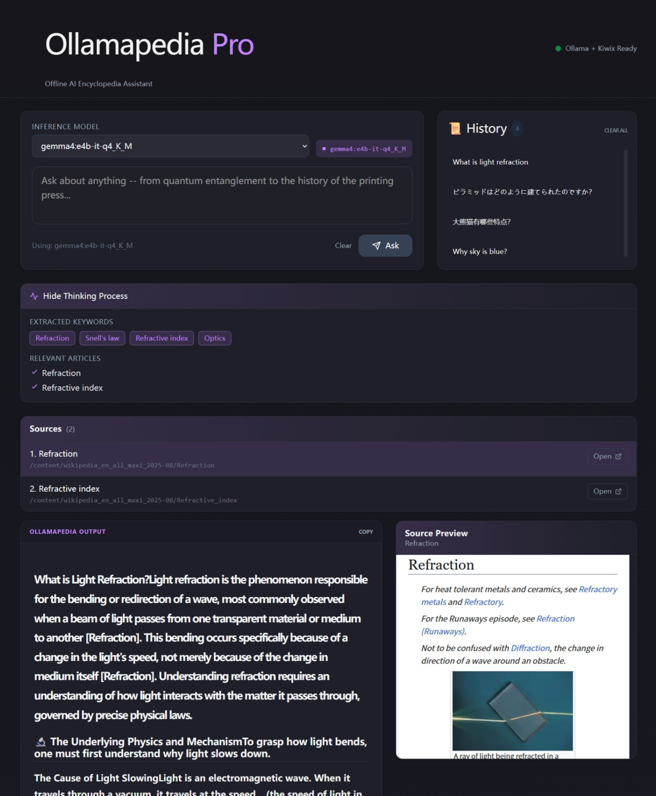

# Ollamapedia Pro



# Ollamapedia Pro

A fully local/offline AI encyclopedia assistant that combines Ollama (inference) with Kiwix (offline Wikipedia knowledge base) to generate cited, knowledgeable answers -- with zero internet required.

## Features

- **Offline Knowledge Retrieval** -- searches Kiwix Wikipedia archives locally for grounded answers
- **RAG Pipeline** -- keyword extraction, article retrieval, relevance ranking, and context building
- **Streaming Answers** -- real-time Ollama LLM responses with a purple cursor indicator
- **Source Citations** -- numbered bibliography with clickable links to offline articles
- **Thinking Process** -- visible pipeline stages showing extracted keywords and matched articles
- **Source Preview** -- side-by-side Kiwix article preview while reading the generated answer
- **Health Monitoring** -- live status indicator for Ollama, Kiwix, and backend connectivity
- **Model Selector** -- choose from any locally-installed Ollama model
- **Dark Mode** -- full light/dark theme with system preference detection
- **Fully Local** -- no cloud APIs, no data leaves your machine
- **Local History Management** -- Save answers with keywords and source links automatically; browse or delete past research sessions stored locally in the browser.

## Architecture

```
User Question (Browser)
        ↓
  FastAPI Backend (Orchestrator)
        ↓
  ┌── Query Understanding ──┐
  │ - Keyword extraction     │
  │ - Query rewrite          │
  └──┬───────────────────────┘
     ↓
  ┌── Kiwix Search API ────┐
  │ - Multi-keyword search   │
  │ - Candidate articles     │
  └──┬───────────────────────┘
     ↓
  ┌── Ranking + Context ────┐
  │ - Relevance reranking    │
  │ - Chunk compression      │
  └──┬───────────────────────┘
     ↓
  ┌── Ollama LLM ──────────┐
  │ - Generate cited answer  │
  │ - Stream tokens          │
  └──┬───────────────────────┘
     ↓
  Streaming UI + Citations
```

## Folder Structure

```
ollamapedia-pro/
├── backend/
│   ├── main.py
│   ├── requirements.txt
│   ├── services/
│   │   ├── ollama_client.py
│   │   ├── kiwix_client.py
│   │   ├── retrieval.py
│   │   └── query_processing.py
│   ├── api/
│   │   ├── endpoints.py
│   │   └── models.py
│   └── utils/
│       ├── health.py
│       ├── logging.py
│       └── error_handling.py
├── frontend/
│   ├── public/
│   │   ├── favicon.svg
│   │   └── icons.svg
│   └── src/
│       ├── components/
│       │   ├── AskForm.jsx
│       │   ├── AnswerDisplay.jsx
│       │   ├── CitationPanel.jsx
│       │   ├── HealthStatus.jsx
│       │   ├── HistoryPanel.jsx
│       │   ├── ModelSelector.jsx
│       │   └── ThinkingAccordion.jsx
│       ├── services/
│       │   └── api.js
│       ├── App.jsx
│       ├── App.css
│       ├── main.jsx
│       └── index.css
├── docs/
├── tests/
└── README.md
```

## Tech Stack

| Layer     | Technology                          |
|-----------|----------------------------------------------------|
| Backend   | Python 3.10+, FastAPI, httpx                       |
| Frontend  | React 19, Vite, Tailwind CSS 4, React-Markdown     |
| Inference | Ollama (Gemma, Qwen)                        |
| Knowledge | Kiwix (offline Wikipedia/ZIM files)                |
| Retrieval | Kiwix Search API, embedding rerank                 |

## Prerequisites

- Python 3.10+
- [Ollama](https://ollama.ai) installed and running locally
- [Kiwix Server](https://kiwix.org) with a ZIM library downloaded
- Node.js 18+

## Quick Start


### 1. Start Kiwix Server
Before starting the backend, you must serve the ZIM file locally:

```bash
.\kiwix-serve.exe wikipedia_en_all_maxi_2025-08.zim
# if your zim file is not "wikipedia_en_all_maxi_2025-08.zim", please modify the KIWIX_LIBRARY_ID in backend/services/kiwix_client.py
```


### 2. Start Backend

```bash
cd backend
pip install -r requirements.txt
cd ..
uvicorn backend.main:app --reload --port 8001
# Backend runs on http://localhost:8001
```

### 3. Start Frontend

```bash
cd frontend
npm install react-markdown remark-math rehype-katex remark-gfm remark-breaks
npm run dev
# Frontend opens at http://localhost:5173
```

### 4. Ask a Question

Select an Ollama model, type your question, and click **Ask**. The pipeline:

1. Extracts keywords from your query
2. Searches Kiwix for relevant articles
3. Ranks results by relevance
4. Generates a cited answer via the selected LLM
5. Streams the response with inline citations

## API Reference

### `POST /ask`

Generate an answer for a given question.

**Request body:**
```json
{
  "question": "Why is the sky blue?",
  "model": "gemma4:latest"
}
```

**Response:** Server-Sent Events stream with tokens and debug markers:
```
DEBUG_KEYWORDS: ["Rayleigh scattering", "atmosphere"]
DEBUG_ARTICLES: ["Rayleigh scattering", "Atmosphere of Earth"]
DEBUG_SOURCES: [{"title": "...", "link": "/Zim/..."}]
{token}
{token}
...
```

### `GET /models`

Returns all available Ollama models.

```json
{
  "models": [
    {"name": "gemma4:latest"},
    {"name": "qwen3.5:latest"}
  ]
}
```

### `GET /health`

Checks connectivity to all services.

```json
{
  "ollama": true,
  "kiwix": true,
  "backend": true
}
```

## Use Cases

- Ask natural language questions about any topic
- Search offline Wikipedia while disconnected from the internet
- Generate cited answers from authoritative sources
- Private, local knowledge assistant -- no data leaves your machine
